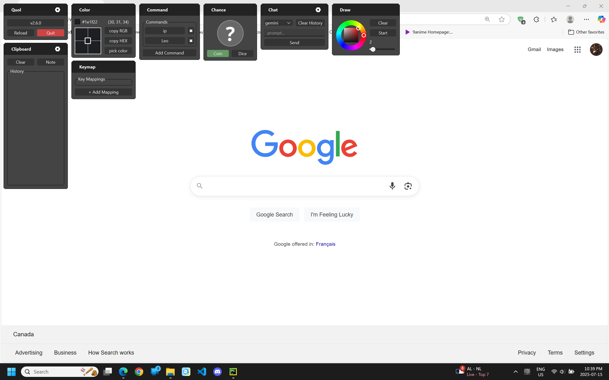
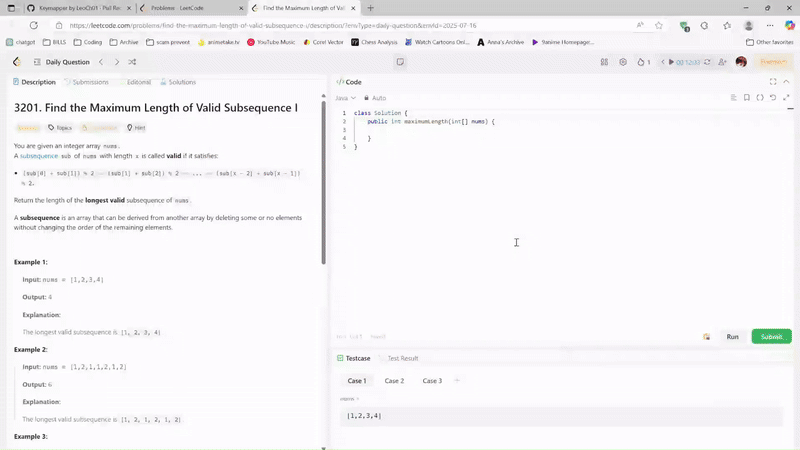

# PySide6 Quick Tools for Windows

## Overview

Quol (Quick-Tool) is a top-layer desktop application built using **PySide6**, designed to serve as a versatile helper tool for Windows. The tool provides an intuitive and user-friendly interface to perform a variety of tasks and enhance productivity.

## Features

- **Chat:** Run AI prompts on your screen.
- **Draw:** Draw and annotate on your screen.
- **Key mapper:** Create key bindings to custom actions.
- **Color Picker:** Select and copy HEX color values on your screen.
- **CMD Runner:** Save and execute custom command line instructions.
- **Clipboard:** Store copy history and sticky notes.
- **Chance:** Flip a coin, roll a dice.
- **Customize:** Create and Add custom windows without rebuilding.

This application Runs at the top layer and is toggleable through a hotkey. Layouts are adjustable to fit your preferences.


<table>
  <tr>
    <td></td>
    <td></td>
  </tr>
  <tr>
    <td></td>
    <td></td>
  </tr>
</table>

## Installation

### Option 1: Installing from ZIP and Running the Executable

To quickly set up and run the application:

1. **Download and Extract the ZIP file:**

   - Download the latest `Quol.zip` file from the releases page.
   - Extract the contents to your desired location on your computer.

2. **Run the Application:**
   - Navigate to the extracted folder.
   - Double-click on `Quol.exe` to launch the application.

### Option 2: Running Locally

To run the application locally or build it as a standalone executable, follow these steps:

1. **Clone the repository:**

   ```bash
   git clone https://github.com/LeoCh01/quol.git
   ```

2. **Set up the Python environment (Python 3.12 recommended):**

   - Create a virtual environment in project directory:

   ```bash
   python -m venv venv
   ```

   - Activate the virtual environment:

   ```bash
   venv\Scripts\activate
   ```

3. **Install the required dependencies:**

   ```bash
   pip install -r requirements.txt
   ```

4. **Run the application locally:**

   - Once the environment is set up, you can run the app by executing:

   ```bash
   python app/main.py
   ```

5. **Building the Executable (Optional):**

   - you can also build the exe yourself by installing `pyinstaller` and using the `quol.spec` file

   ```bash
     pyinstaller quol.spec
   ```

## Adding Custom Windows

To create a new window, you can add a folder to the `windows` directory and add the folder name in the `res/settings.json` file. You can use the template provided in `windows/example` folder as a starting point.

1. **Create your window:**

   ```
   example/
   ├── windows.py
   ├── config.json (optional)
   └── res/ (optional)
   ```

   - `windows.py`: main window script.
   - `config.json`: configurations linked to window script.
   - `res/`: images and other miscellaneous items.

2. **Enable the new window:**

   ```json5
   {
     "windows": [
       "window1",
       "window2",
       "window3",
       "example" // <-- Add your custom window here
     ]
   }
   ```

   - Open the `res/settings.json` file.
   - Add the name of your folder to the `windows` array.

By following these steps, you can easily add custom windows without rebuilding the application.

## Contact

For any support, please reach out to ch3.leoo@gmail.com
