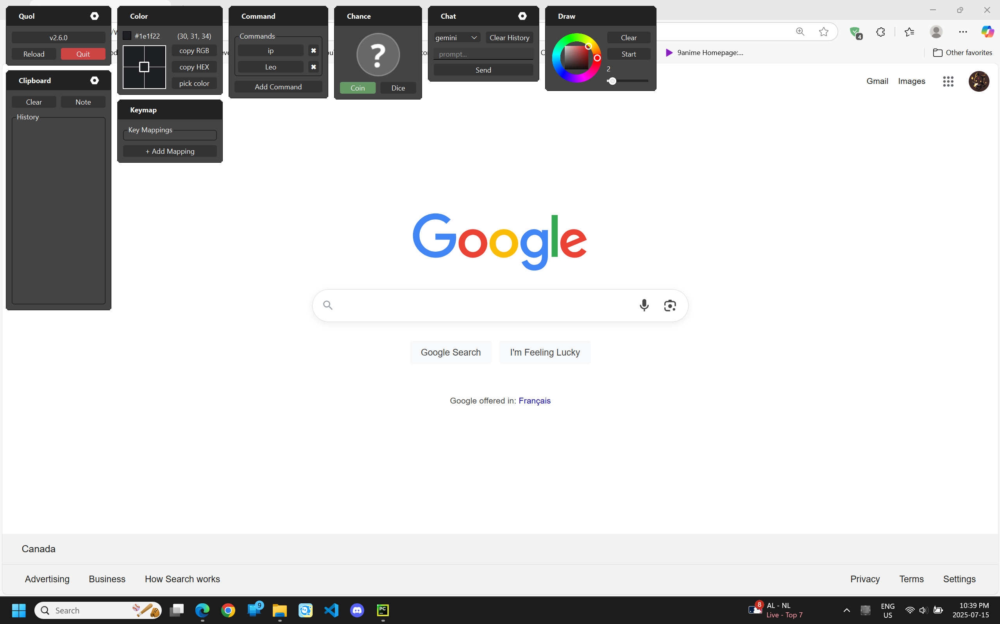
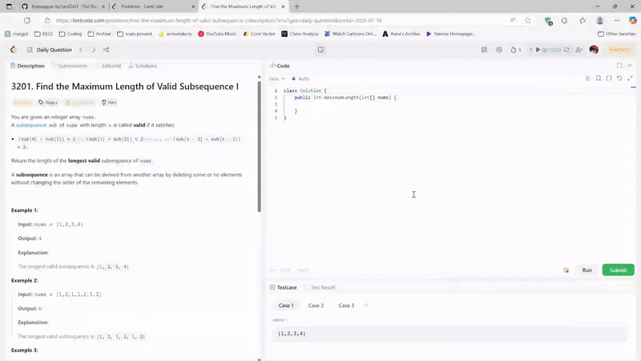

# Quol - Plugin Toolbox for Windows

## Overview

Quol (Quick-Tool) is an overlay desktop application built with ~~Pyside6~~ **Qt 6 / C++** , designed as a plugin toolbox for Windows. Quol provides an intuitive and user-friendly interface to perform a variety of tasks and enhance productivity. (Migrated from Pyside6)

## Features

- Always-on-top window, toggleable through hotkeys
- Adjustable layout and plugin window positioning
- Dynamically loaded plugin system
- Plugin collection maintained in [Quol-Tools](https://github.com/LeoCh01/Quol-Tools)

[//]: # ''

<table>
  <tr>
    <td></td>
    <td></td>
  </tr>
  <tr>
    <td></td>
    <td></td>
  </tr>
</table>

## Installation

Click [here](https://github.com/LeoCh01/Quol/releases) for the latest release of Quol.

1. **Download and Extract the ZIP file:**
   - Download the latest `Quol.zip` file from the releases page.
   - Extract the contents to your desired location on your computer.

2. **Run the Application:**
   - Navigate to the extracted folder.
   - Double-click on `Quol.exe` to launch the application.

## Adding Custom Plugins

Plugins are located under the path specified in the `settings.json` `plugins_dir` field. (default `./plugins`)

Example plugin folder structure:

```
myPlugin/
├── myPlugin.dll
├── res/config.json
```

- `myPlugin.dll`: plugin binary. The DLL name must match the folder name.
- `res/config.json`: plugin-specific config passed to the plugin at runtime.

Plugins within the path can be loaded with the built-in `Manage Plugins` window.

## Creating and Building a Plugin

Plugin source layout:

```
plugins/myPlugin/
├── CMakeLists.txt
├── MyPlugin.cpp
├── MyPlugin.hpp
├── res/config.json
└── lib/ (optional)
```

A Quol plugin needs a class that inherits both `QObject` and `IQuolPlugin`, and implements `createWidget(...)`, `initialize(...)`, `onUpdateConfig(...)` and `shutdown()`.

Example `MyPlugin.hpp`:

```cpp
#pragma once

#include "plugin_api/IQuolPlugin.hpp"
#include <QObject>

class QLabel;

class MyPlugin final : public QObject, public IQuolPlugin {
    Q_OBJECT
    Q_PLUGIN_METADATA(IID IQuolPlugin_iid)
    Q_INTERFACES(IQuolPlugin)

public:
    QWidget *createWidget(QWidget *parent = nullptr) override;
    void initialize(const QString &pluginRootPath,
                    const PluginConfig &pluginConfig,
                    QuolServices *services) override;
    void onUpdateConfig(const PluginConfig &pluginConfig) override;
    void shutdown() override;

private:
    PluginConfig m_cfg;

    QLabel *m_label = nullptr;
};
```

Example `MyPlugin.cpp`:

```cpp
#include "plugins/myPlugin/MyPlugin.hpp"

#include <QLabel>
#include <QVBoxLayout>
#include <QWidget>

QWidget *MyPlugin::createWidget(QWidget *parent) {
    auto *widget = new QWidget(parent);
    auto *layout = new QVBoxLayout(widget);
    layout->setContentsMargins(0, 0, 0, 0);

    const int number = m_cfg.get("number", 0).toInt();

    m_label = new QLabel(QString("Hello %1").arg(number), widget);
    layout->addWidget(m_label);
    return widget;
}

void MyPlugin::initialize(const QString &pluginRootPath,
                          const PluginConfig &pluginConfig,
                          QuolServices *services) {
    Q_UNUSED(pluginRootPath)
    Q_UNUSED(services)
    m_cfg = pluginConfig;
}

void MyPlugin::onUpdateConfig(const PluginConfig &pluginConfig) {
    m_cfg = pluginConfig;
    if (!m_label)
        return;

    const int number = m_cfg.get("number", 0).toInt();
    m_label->setText(QString("Hello %1").arg(number));
}

void MyPlugin::shutdown() {}
```

Example `res/config.json`:

```json
{
  "_": {
    "default_geometry": [400, 400, 280, 0],
    "name": "Example",
    "version": 1,
    "description": "Example Quol C++ plugin"
  },
  "number": 123
}
```

The `_` object is reserved for plugin metadata.

For `CMakeLists.txt`, use one of the plugin examples in the [Quol-Tools](https://github.com/LeoCh01/Quol-Tools) repo as the template.

## Contact

For any support, please reach out to ch3.leoo@gmail.com
